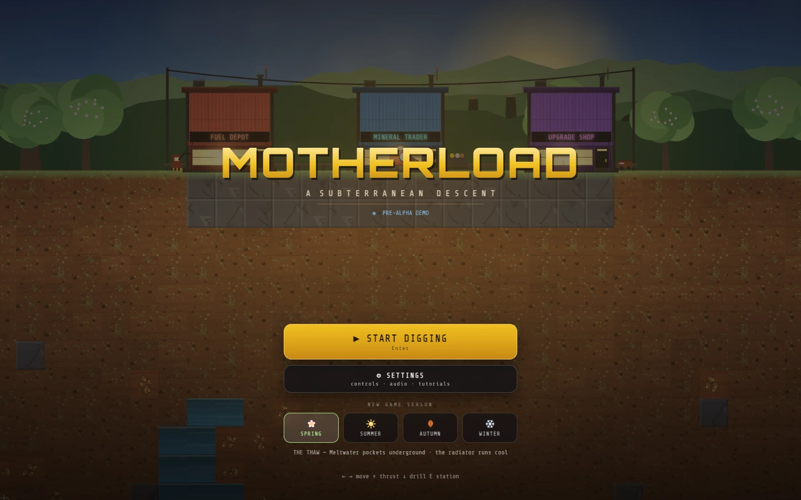
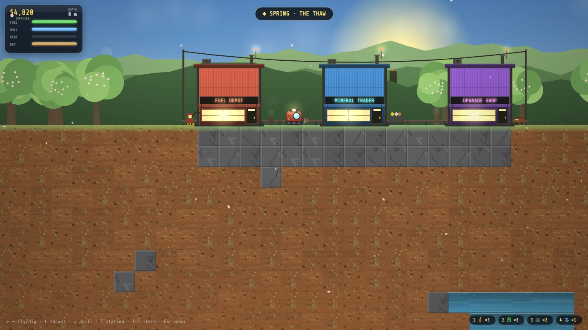
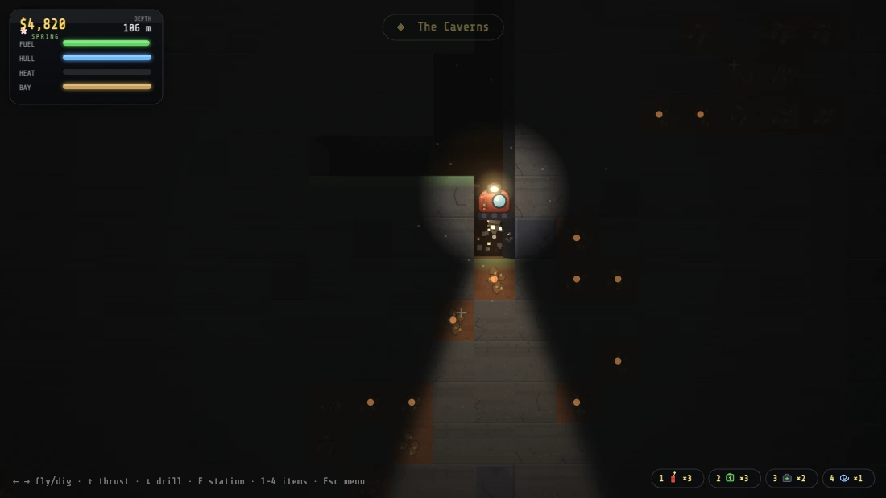
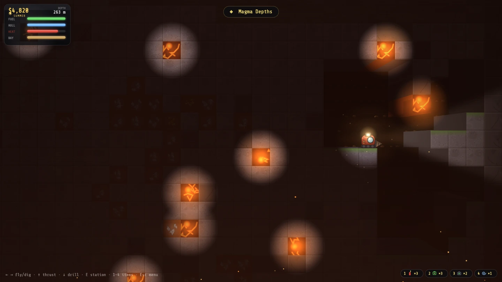
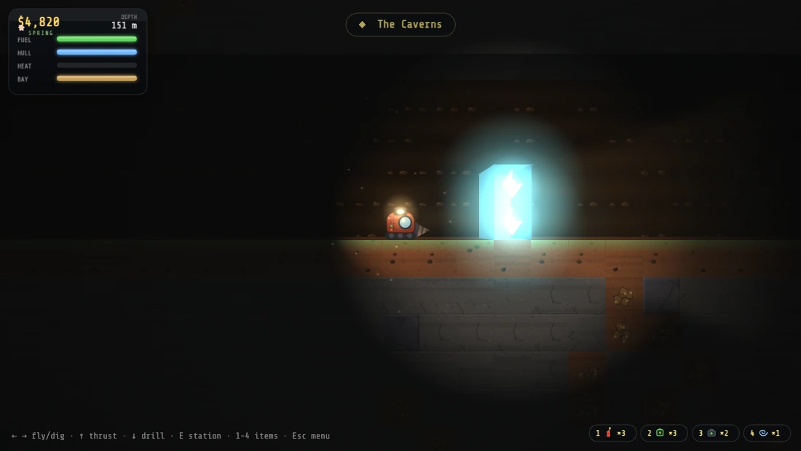
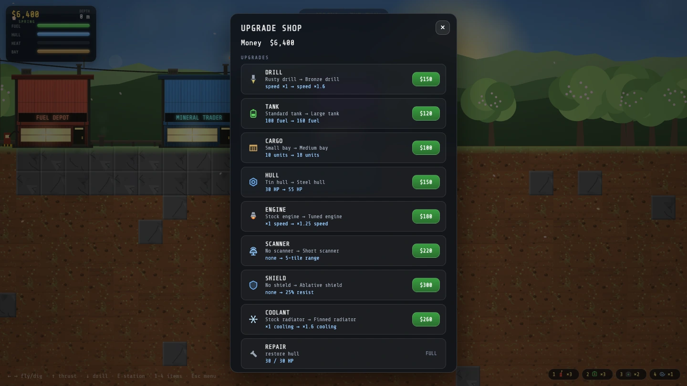
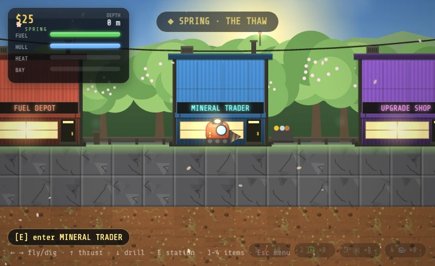
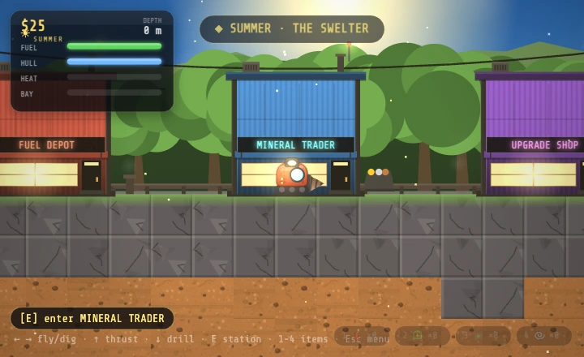
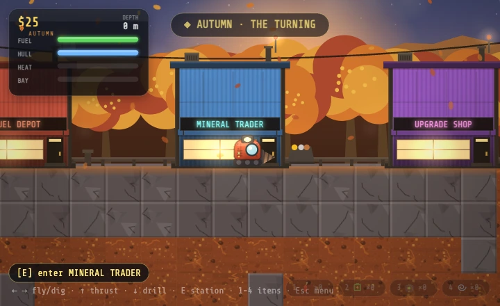
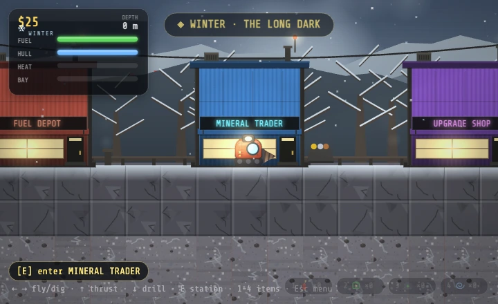

# Motherload

A browser clone of the classic mining game
[Motherload](https://en.wikipedia.org/wiki/Motherload_(video_game)) — fly a pod
underground, drill for minerals, and try to make it back up before the fuel runs
out.

[](https://github.com/michael-baker-us/motherload/actions/workflows/ci.yml)

**[▶ Play it in your browser](https://michael-baker-us.github.io/motherload/)**



Built from scratch in TypeScript on the Canvas 2D API — no game engine, no
sprite assets, no audio files. The game loop, tile physics, camera, lighting,
procedural art and synthesized sound are all hand-rolled, which was the whole
point: this is a learning project as much as it is a game.

## The loop

Sell your haul, refuel, buy a better drill, go deeper. Every trip down is a bet
that you can find something worth more than the fuel it takes to reach it.



Three shops sit on the surface: a **fuel depot**, a **mineral trader** to sell
what you've dug up, and an **upgrade shop**. Progress autosaves whenever you're
topside, so a run ends when you decide it does.



Below the topsoil it gets dark fast, and your headlamp is the only thing showing
you the rock. Ore is worth more the deeper it's buried — and so is the trip back.
The scanner upgrade paints nearby seams as pips in the dark, which is the
difference between digging blind and digging on purpose.



Depth is split into biomes — **Topsoil**, **The Caverns**, **Magma Depths**, and
**The Deep** — each with its own rock, fog, ambient rumble and heat. Down here
the pod cooks: heat is a second resource alongside fuel, and lava, gas pockets
and a hard landing will all take a bite out of your hull.



At 150 m there's something buried that isn't rock. Reaching it is optional — the
objective is off by default, so a standard run is an open-ended sandbox — but
switch it on and the descent gets a destination.

## Getting deeper



Eight upgrade tracks (drill, tank, cargo, hull, engine, scanner, shield,
coolant) give you the straight-line progression. On top of that sit **modules** —
Turbocharger, Cargo Compactor, Fuel Recycler, Ablative Plating, Ore Probe — which
you can own freely but only equip two at a time, so the interesting question
isn't what you can afford, it's what you leave behind. Four consumables
(dynamite, fuel cell, repair kit, teleporter) ride on the pod and are lost with
it.

### Four seasons

Pick a season when you start a run and it stays fixed for that run, changing the
sky, the treeline, the weather, the colour grade, the ambient audio, the ground
you dig through, and a handful of gameplay modifiers. Spring leaves meltwater
pockets underground and runs the radiator cool; winter freezes the ground hard
and burns fuel richer.

<table>
  <tr>
    <td width="50%"></td>
    <td width="50%"></td>
  </tr>
  <tr>
    <td></td>
    <td></td>
  </tr>
</table>

## Controls

| Key | Action |
| --- | --- |
| <kbd>←</kbd> <kbd>→</kbd> | Fly and dig sideways |
| <kbd>↑</kbd> | Thrust |
| <kbd>↓</kbd> | Drill down |
| <kbd>1</kbd>–<kbd>4</kbd> | Use a consumable |
| <kbd>E</kbd> | Enter a station |
| <kbd>Esc</kbd> | Settings |

WASD works too, and the gameplay keys are rebindable in the settings menu.
On a phone or tablet you get on-screen controls instead — either a fixed D-pad
or a floating thumbstick, whichever you prefer.

## Running it locally

```bash
npm install
npm run dev         # local dev server
npm test            # unit tests (Vitest, run once)
npm run test:watch  # unit tests in watch mode
npm run build       # type-check (tsc --noEmit) + production build
npm run preview     # serve the production build
```

Needs Node 20.19+ or 22.12+ (CI runs 22). Pushes to `main` run the tests and
deploy to GitHub Pages via
[`.github/workflows/ci.yml`](.github/workflows/ci.yml).

## How it's built

```text
src/
  engine/       game-agnostic: fixed-timestep loop, input + key bindings, camera, math
  render/       all drawing: baked tile art, lighting, post-FX, sky, weather, particles
  audio/        procedural (asset-free) sound engine + persisted settings
  game/         all simulation logic — pure of DOM/canvas, unit-tested
    config.ts   every tunable number, gameplay and visual
    world.ts    tile grid (Uint8Array), seeded procedural generation
    physics.ts  gravity, thrust, axis-separated AABB-vs-tile collision
    tiles.ts    materials, strata and ores — the data behind the terrain
    biomes.ts   depth zones layering fog/tint/ambient heat over the strata
    seasons.ts  per-run surface identity: sky, weather, grade, modifiers
    heat.ts     second resource axis — depth heats you, the radiator cools you
    save.ts     versioned save = seed + tile diff + player/economy state
  ui/           HUD, shop/menu overlays, touch controls, crash screen
```

A few decisions that shaped everything else:

**The simulation never touches the DOM.** Everything in `game/` is plain state
and math, so it runs under Vitest in Node with no browser and no canvas — 330
tests across 36 files. Rendering reads game state but never writes to it.

**Saves store a seed and a diff, not a world.** Worldgen is deterministic, so a
save is the seed plus every tile you've changed since. Loading re-runs generation
and replays the diff, which keeps saves tiny and makes the whole world
reproducible.

**All the tuning lives in one file.** Every game-feel and balance number —
physics, fuel burn, prices, hazard rates, lighting, bloom — is a named constant
in `config.ts`, so tuning is a one-file job rather than a scavenger hunt.

**The renderer is a real pipeline.** Opaque world pass → biome wash → lighting →
depth haze → additive emissive pass → bloom → heat shimmer → seasonal colour
grade. Tile textures and gradient sprites are baked once at startup rather than
rebuilt per frame.

There's more detail in [`CLAUDE.md`](CLAUDE.md) — the state machine, the effect
queue, the data-driven content tables and the save-safety invariant.

## Playtesting tools

The settings menu (<kbd>Esc</kbd>) has a **Dev · Testing** section: cheat toggles
(unlimited fuel/funds, no damage, dig anything, no overheating), one-shot grants
(max upgrades, all modules, all items, cash, refill), warps to any biome or the
anomaly, and a telemetry overlay. Touching any of it marks the run so it can't
overwrite a real save.

## License

[MIT](LICENSE) — do what you like with the code, just keep the copyright notice.

That covers the code in this repository, which is written from scratch. It
doesn't extend to the *Motherload* name or the original game's design, which
belong to their owners.

## Credits

A tribute to the original *Motherload* by [XGen Studios](https://www.xgenstudios.com/).
This is an independent reimplementation built for learning — no original code or
assets are used. Not affiliated with or endorsed by XGen Studios.
